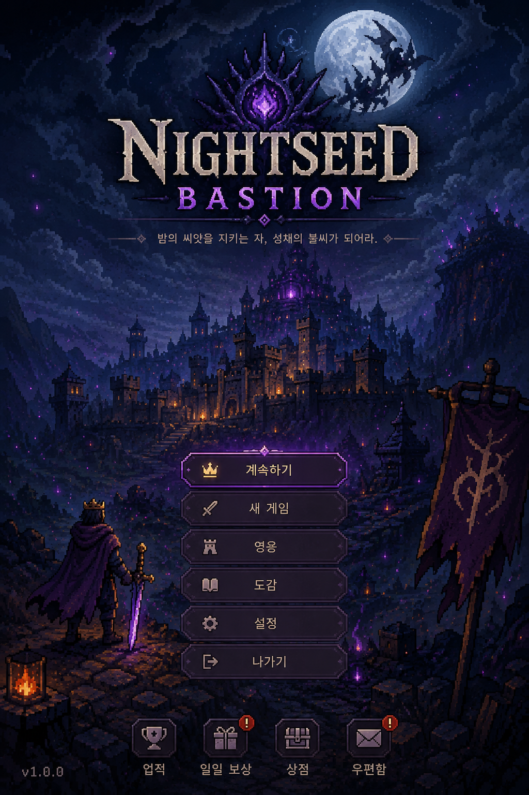

<p align="center">
  
</p>

# Nightseed Bastion

> **Build a cursed moonlit bastion by day. Read the enemy omen at dusk. Defend the walls at night. Survive enough nights to cleanse the Nightseed at the heart of the fortress.**
>
> 저주받은 달빛 성채를 낮 동안 건설하고, 황혼에 적의 징조를 읽고, 밤이 오면 영웅과 함께 직접 방어하세요. 충분히 많은 밤을 버텨낸 자만이 성채 한가운데 박힌 **나이트시드**를 정화할 수 있습니다.

<p align="center" style="margin-top: 1.2em;">
  <a class="btn" href="https://github.com/jeiel85/nightseed-bastion">⭐ View on GitHub</a>
  <a class="btn" href="00_START_HERE.html">🚀 Start Here</a>
  <a class="btn" href="02_GAME_DESIGN_DOCUMENT.html">📘 Game Design Doc</a>
  <a class="btn" href="13_BACKLOG.html">📋 Backlog</a>
</p>

---

## 📌 한눈에 보기 / At a Glance

| 항목 | 값 |
| --- | --- |
| **장르 / Genre** | 세로 모바일 요새 생존 전략 액션 · Vertical mobile fortress-survival strategy |
| **엔진 / Engine** | Godot 4.x · GDScript |
| **플랫폼 / Platform** | Android 1차 출시 → iOS 후속 |
| **화면 / Orientation** | Portrait 9:16, 한 손 조작 우선 |
| **언어 / Locales** | 한국어(1차) / English (필수) |
| **세션 / Session** | 한 밤 90–150초 · 풀 런 12–18분 |
| **상태 / Status** | Pre-alpha — 설계 패키지 완료, 구현 착수 |

---

## ✨ 핵심 차별화 / Pillars

1. **Vertical One-Thumb Strategy** — PC RTS를 그대로 옮긴 UI가 아니라, 처음부터 엄지 하나로 끝낼 수 있게 9:16으로 설계.
2. **Dusk Omen** — 전투 시작 전, 어느 레인으로 어떤 적이 올지 미리 읽고 대비.
3. **Dusk Bargain** — 저주받은 거래로 더 큰 보상을 노리는 위험-보상 카드.
4. **Hero × Fortress Hybrid** — 영웅은 직접 조작, 타워·벽·함정은 자동 작동.
5. **Run-based Bastion Evolution** — 매 런마다 임시 성채, 메타 진척으로 영구 해금. *No gacha, no pay-to-win.*

---

## 🌗 코어 루프 / Core Loop

```text
새벽 보상 → 낮 건설 → 황혼 오멘 → 황혼 거래 → 밤 전투 → 밤 결산 → 새벽 보상 …
 Dawn  →  Day  →  Dusk Omen  →  Bargain  →  Night  →  Resolution  →  Dawn …
```

자세한 상태 머신과 안티버그 규칙은 [03_CORE_LOOP_AND_STATE_MACHINE](03_CORE_LOOP_AND_STATE_MACHINE.html)에서 확인할 수 있습니다.

---

## 🏰 첫 수직 슬라이스 / First Vertical Slice

첫 플레이 가능 빌드는 단순 MVP가 아니라 **프로덕션 품질의 수직 슬라이스**입니다.

- 맵: `moonwell_bastion` (3 레인 · 7박 · 보스 밤 1회)
- 영웅 1: **Vagrant Warden** — 근접 / Warden's Mark / Last Lantern 패시브
- 건물 6: Bastion Core · Moonwell · Watchtower · Ember Brazier · Thorn Wall · Grave Snare
- 적 5 + 보스: Huskling · Bone Runner · Lantern Eater · Grave Brute · Hex Archer · **Nightseed Herald**
- 결과물: Android Debug APK + Internal Test AAB

---

## 📚 설계 문서 / Design Docs

| # | 문서 | 한 줄 요약 |
| ---: | --- | --- |
| 00 | [START_HERE](00_START_HERE.html) | 구현 진입점 · 첫 10개 작업 |
| 01 | [PRODUCT_BRIEF](01_PRODUCT_BRIEF.html) | 제품 정체성 · 타깃 · 수익화 |
| 02 | [GAME_DESIGN_DOCUMENT](02_GAME_DESIGN_DOCUMENT.html) | 게임 디자인 본편 |
| 03 | [CORE_LOOP_AND_STATE_MACHINE](03_CORE_LOOP_AND_STATE_MACHINE.html) | 페이즈 상태 머신 |
| 04 | [GAME_SYSTEMS_IMPLEMENTATION](04_GAME_SYSTEMS_IMPLEMENTATION.html) | 시스템 구현 설계 |
| 05 | [LEVEL_AND_CONTENT_DESIGN](05_LEVEL_AND_CONTENT_DESIGN.html) | 레벨/콘텐츠 |
| 06 | [BALANCE_MODEL](06_BALANCE_MODEL.html) | 밸런스 모델 |
| 07 | [MOBILE_UX_GUIDE](07_MOBILE_UX_GUIDE.html) | 모바일 UX 가이드 |
| 08 | [ART_AUDIO_GUIDE](08_ART_AUDIO_GUIDE.html) | 아트 & 오디오 가이드 |
| 09 | [TECHNICAL_ARCHITECTURE](09_TECHNICAL_ARCHITECTURE.html) | 기술 아키텍처 |
| 10 | [SCENE_SCRIPT_CONTRACTS](10_SCENE_SCRIPT_CONTRACTS.html) | 씬/스크립트 계약 |
| 11 | [DATA_SCHEMA](11_DATA_SCHEMA.html) | JSON / 세이브 스키마 |
| 12 | [SAVE_AND_MIGRATION](12_SAVE_AND_MIGRATION.html) | 세이브 마이그레이션 |
| 13 | [BACKLOG](13_BACKLOG.html) | P0 / P1 / P2 백로그 |
| 14 | [ROADMAP](14_ROADMAP.html) | 출시 로드맵 |
| 15 | [VIBE_CODING_PLAYBOOK](15_VIBE_CODING_PLAYBOOK.html) | AI 페어 프로그래밍 가이드 |
| 16 | [TESTING_QA_RELEASE](16_TESTING_QA_RELEASE.html) | 테스트 & QA |
| 17 | [STORE_LAUNCH_PLAN](17_STORE_LAUNCH_PLAN.html) | 스토어 출시 계획 |
| 18 | [IP_AND_CLONE_GUARDRAILS](18_IP_AND_CLONE_GUARDRAILS.html) | IP 가드레일 |
| 19 | [AI_ASSET_PIPELINE](19_AI_ASSET_PIPELINE.html) | AI 에셋 파이프라인 |
| 20 | [DECISION_LOG](20_DECISION_LOG.html) | 의사결정 로그 |

---

## 🛠 개발 상태 / Project Status

- ✅ 설계 패키지 (`docs/00`~`20`) 완료
- ✅ JSON 데이터 샘플 (`data/*.json`) 확보
- ✅ 한/영 로컬라이제이션 CSV 스켈레톤
- ✅ Godot 프로젝트 골격 (`project.godot` + autoload 스크립트 스텁)
- ⏳ **P0-001 → P0-010** (코어 루프 구현) 착수 예정

진척은 [HISTORY.md](https://github.com/jeiel85/nightseed-bastion/blob/main/HISTORY.md) 및 [CHANGELOG.md](https://github.com/jeiel85/nightseed-bastion/blob/main/CHANGELOG.md)에서 추적됩니다.

---

## 🛡️ Non-Goals · IP 가드레일

기존 게임의 화면 구성, 이름, 아이콘, 건물 구성, 색 정체성을 복제하지 **않습니다**. 가차, 강제 광고, P2W 업그레이드도 넣지 **않습니다**. 자세한 사항은 [18_IP_AND_CLONE_GUARDRAILS](18_IP_AND_CLONE_GUARDRAILS.html) 참고.

---

<p align="center" style="opacity:.65; font-size:.9em;">
  © 2026 jeiel85 · Built with Godot 4.x · Site by Jekyll on GitHub Pages
</p>
